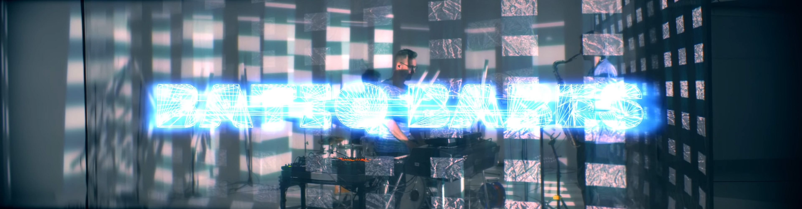
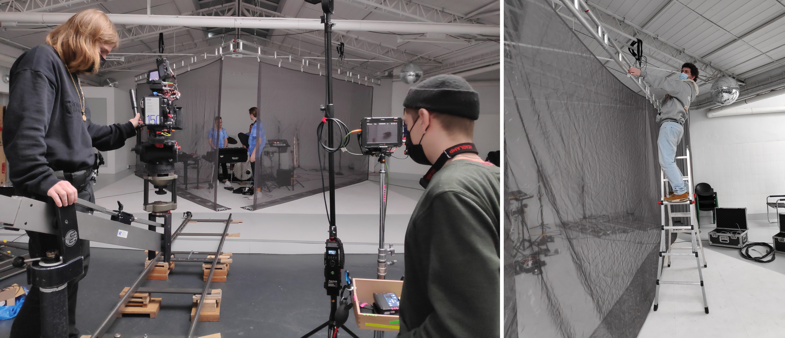

# Batiq Babes

## Goal

With this project I collaborated with a friends band from Cologne "Batiq Babes. We wanted to work with semi-transparent projection screens for a music video. I was in charge of the visuals and the projection-setup. We had two of these [projection screens](https://www.lasergaze.de/shop/projektionsmedien/lasergewebe/laserscrim-grau/) at our disposal. The basic concept of the music video was to have visual video-content that is reacting to the music which is being played by the musicians behind the projection screen and still be able to see the musicians behind that. To make this semitransparent visual work, I wanted to go into the direction of full contrast black and white visuals, that should be programmed in vvvv-beta. This should be live screen-record to be used for the shooting of the music video on site. The two videos [In Dubai](https://www.youtube.com/watch?v=BB0WJhxGa5c) and [Aliens](https://www.youtube.com/watch?v=BB0WJhxGa5c) are available when clicking on their respective links.

Basic visual concept for in **Dubai**:

- Because of the very straight forward rhythmic patterns of the song and also with the see through aspect in mind, I decided to make use of a very basic visual pattern by only using rectangles
  - array of rectangles that move horizontally
  - every second row should shift upwards one row on every hit of the kickdrum
  - the rectangles that shift up one row should subtract from the color from the rectangle they shifted up to
  - for a spacy interlude of the song I wanted to make the whole scenery colorful and also displace the whole texture

Basic concept for **Aliens**:

- In my perception this song is a little bit more bouncy, soft and round, so I thought of using signed distance field spheres because of their soft interpolation possibilities towards each other.
  - the softness between them should change according to the music
  - the whole texture should invert on every snare hit
  - there also is a spacy interlude section that should be supported by more colorful change in scenery which I wanted to achieve by using a rgb-shifter
  - the change from that into the more lets say rusty part of the song should then be supported by a disturbed texture which, like the rgb-shifter, should be achieved by a displace function
  - also keep in mind the see through aspect in mind by using full white and black

## Implementation

### In Dubai

Basic structure of the program is as follows:

- Two arrays are being shifted horizontally by using the phase parameter of the instancing node called linearSpread
- one of these linearSpreads is also shifted vertically with the same approach as mentioned above
  - The shifting of the phase is done manually by hand when pushing a button on a Midi-controller
  - speed of shifting can also be manually adjusted
- rectangles can scale audio reactive with the RMS values of the audio sum
  - scaling is done by sampling a noise field which is integrated over by time
  - the overall amount of the scaling can be adjusted via Midi
- the rendered texture is then being displaced by another procedural noise texture
  - the speed of moving through the noise field can be adjusted by Midi
  - for more abrupt changes in movement a threshold of sampled random values triggers random time positions
- a video was recorded with OBS-Recorder while playing and adjusting the Midi-controllers to the music
  - the video was recorded in the format of 32 by 9 because I didn't wanted to have the same content on the two projection screens

### Aliens

Basic structure of the program is as follows:

- six different audio tracks are bounced in Ableton
- Those separate audio tracks are live processed inside of vvvv and used to control various parameters to make everything audio reactive
  - ch7 → kickdrum track is analysed  with a beatDetector to invert the whole texture on every hit
  - ch3 → snare track is analysed with a beatDetector to count one up on every hit
    - every up on the counter is then used to step through the seed values of a randomSpread to reposition the sdf spheres in 3D
    - the sdf-spheres are combined into meatballs by a combineSDF function
    - the repositioning can be turned on and off via Midi by switching from the up counting seed value to a constant
  - ch4 → chords track is analysed with a RMS and beatDetector function and it's value is used for displacing the overall texture
    - displacing is done by a texture of randomly placed, scaled and colored rectangles that changed their parameters according to their constantly up counted seed values
    - can be raised and lowered by Midi-controller
  - ch6 → saxophone track is analysed with a RMS function which is then used to control the strength of a RGB-shifter
    - RGB-shifter is not controlled by a constant value but by a procedural SDF-noise which makes the shifting appear more natural and beautiful
    - can be raised and lowered by Midi-controller
  - ch5 → bass track's overall volume is used for controlling the smoothing parameter between all the sdfSpheres
- A video was recorded with OBS-Recorder while playing and adjusting the Midi-controllers to the music, also in the format of 32 by 9

### Videoplayback for shooting on site

For shooting the music video we needed the music and the video to be playback. This is due to the fact that if the music and the video would be played live, all the different recordings would not really fit together in editing because one can't play music and video always exactly the same in every take. Therefore we thought of rendering multiple shorter video clips and play them back whenever we would record a take from whatever angle. The bandleader would pick a predefined timecode in Ableton from the prepared shot list, start the playback music and the video would start playing from the same timecode. The problem with normal encoded h264 video footage is that it can run out of sync or even not really start as quickly as I thought it would when choosing a different timecode location. So the visuals would not be in sync with what the band is playing.
This can be fixed by using another kind of codec. In terms of vvvv-beta there is a solution to this problem, the HAP-codec.
The overall program for playing back the visuals in sync with the audio is outlined like this:

- 11 different midi notes for each timecode of the track are send from the interface of the bandleader to my interface
  - each Midi note then selects a timecode to start the screen recorded video at
  - this way we could start shooting the music video on site properly according to the shot list of the directors department

## Learnings

- Combine Ableton with vvvv-beta
- feedback audio internally into interface via jack or SPDIF
- combine sdf-spheres or so called meatballs
- procedural noise controlled rgb-shifting
- rgb-based displacement
- sender and receiver in vvvv-beta (I think this would be global variables)
- timecode-based real time playback
  - HAP Mediaplayer - codec