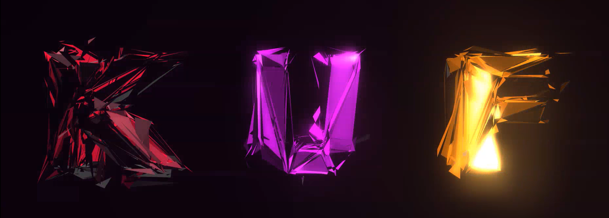

# KUF Font Live Visuals

## Goal

To extend my visual setup for future Live performances with my main band KUF, I wanted to have a reactive introduction visual when people gather in the venue before the show is starting. The visual should be simply pointing out the band playing tonight. So in a it was very obvious to go into the direction of using the letters of the band name themselves because they alone look great. Also because the band consists of three musicians. 
When the musicians enter the stage and begin to play the visual that has been shown the whole time before should start reacting to the music. The letters should bounce and rotate all over the place in sync with the beat. Because my current visual setup uses a lot of midi controllers to run the show it needed to be controlled via Midi.
In the process of programming I found out about how to make use of tessellation in combination with displacement in real time and used that to refine the look of the letters and even to have one more layers of reactive parameters to play with.
My visual setup to go is written entirely in vvvv-beta so to expand my visual setup this project needed to be realized in vvvv-beta too.
A demo video can be found [here](https://www.youtube.com/watch?v=iE4B0-lxN9w)

## Implementation

At first I thought of doing everything from the ground up in vvvv-beta. I wanted to:

- write the letters KUF by making use of simple characters
- extrude the letters to make them 3d
- tesselate the extruded letters
- displaced the extruded letters with the help of some noise

But I didn't find any way to extrude text in vvvv, so I had to go a different route. I took a detour of modelling the letters beforehand in blender. and then exporting them as an .obj. After doing that the program is roughly outlined like this:

- Import the three letters as a geometry file into vvvv-beta
- tessellated the object
  - here I had a little problem in the curved areas of the letter "U" because this letter is exported with a lot of detailed vertices in the curved area. This looks a bit unnatural when displacing the vertices because there are a lot of "spikes" in the curved area but very big triangles in the flatter regions.
    - the solution was to use the decimate modifier in blender -> by using this the vertex resolution get's lowered
- displace vertices with a procedural noise function with a higher frequency
- find suitable parameters like scale, rotation, color, displacement strength and tessellation amount
- program midi mappings

## Learnings

With this project to have another visual setup for live-performances in my pocket I learned the following:

- how to make use of font for live visuals
- 3d object import into vvvv-beta
- geometry effects like:
  - displacement
  - tessellator
  - vertex noise
- post effects like
  - bloom & glow
- render pipeline stages like:
  - tessellation