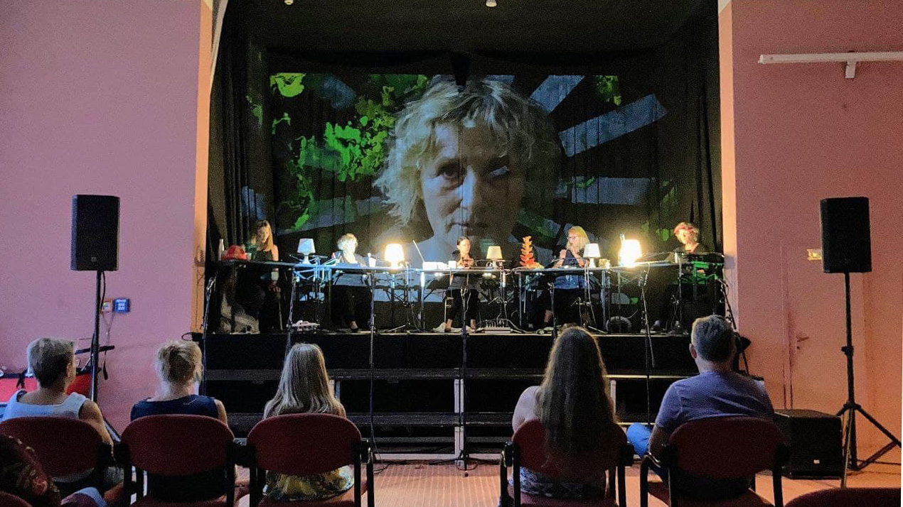
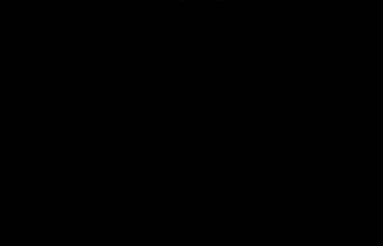

# Aus Der Zeit Gefallen

## Goal

With this project I collaborated with a friend for a children's theater piece. I wanted to design a visual scene for each location in the script that could be changed to suit the course of the plot. Therefore I thought of projecting the visual scenes with a projector on the backdrop of the stage. The children should be able to interact with a time machine, radio reports should be visualized, an abstract forest through which the children wander, a night scene under a street lamp, flying sweets and various video scenes of protagonists should be played. As this was a broad catalog of requirements, I wanted to implement this with the vvvv-beta software, as it is ideal for this purpose as a multipurpose toolkit.

### Implementation

#### Time machine

This gif demonstrates the different states the time machine is in during the theater play. Every state can be adjusted via midi-controller according to what is happening on stage.

The different states are:

- normal working (rotating at different speeds) time machine
  - 3 cascaded circular spreads of rectangles, scaled up in y-direction, that can rotate at 3 different speeds
- broken time machine
  - every rectangle is rotated in a random position via a random spread
- shiny or rusty time machine
  - this is done by a texture blend from a brushed steel to rusty iron
- kids spray onto the time machine
  - random spread of control points for multiple b-splines that are drawn by walking their path's
  - to make the graffiti look more natural an fractal multiplied  noise was used to displace the texture with a finer grain

#### Forest

This gif demonstrates the different states of the abstract forest the kids could walk through which can also be adjusted via midi.

The different states are:

- abstract forest
  - multiple quads that reference the colors of the forest: green, yellow, brown, blue are displaced by an fractal multiplied noise with another scalar multiplication of the noise which is then together domain distorted
- forest at night or day-time
  - shape and center of the noises in combination with the luminance of the quad's colors are shifted up and down with an offset
- walking or standing in the forest
  - time and domain-offset are integrated over time

#### Radio

The gif below demonstrates the visual and it's respective state for the radio that was needed for several scenes of the play. As usual, everything can be controlled via midi

The functionality is as follows:

- audio buffer is read 
  - the values from the buffer are used to displace small circles from a linearSpread in the y-direction
  - the changes in y-direction are smoothed by using a filter
- for transitioning into a more space or universe like scenario all circles are pushed into 3d space with a random spread
- according to the height of the circles the hue value changes

### Bonbons

The gif below demonstrates the visual of the bonbons. It should be able to spawn several bonbons/spheres over time, let them fly around and then at a certain point in the play fall to the ground and later rise back up again.

The functionality is as follows:

- a collision scene is setup with a bounding box and dynamic/rigid bodys with normal phong lighting
- spawning of circles by counting up the size of a random spread
- in combination to normal gravity force a spherical force is applied
- gravity can be switched on and off

### Street lamp

The gif below demonstrates the general functionality of the streetlamp visual. This visual was thought to support a scene at night where small flies in the light of a street lamp.

The functionality is as follows:

- a basic texture with various circles moving circles is set up
  - circles are moving by adding up random values
- the texture is then fed into a ported [light/shadow transportation](https://github.com/mattdesl/lwjgl-basics/wiki/2D-Pixel-Perfect-Shadows) algorithm to create the shadow

To blend between visual setting a particle system was implemented that breaks off the overall texture and disperses it into tiny pieces that fly around and the come back together. Furthermore a video playback engine was build to  fire of some prerecorded videos of the protagonists and blend between their different emotional states. In addition to that a custom texture glitch effect was build in.

### Learnings

- interactive visuals for theater plays are very suitable to do because to be able to adjust the visuals manually via Midi is a great advantage when comparing it only to linear looped video especially when dealing with children in a theater context
- texturing of multiple objects with one texture
- collisions, rigid and dynamic bodies