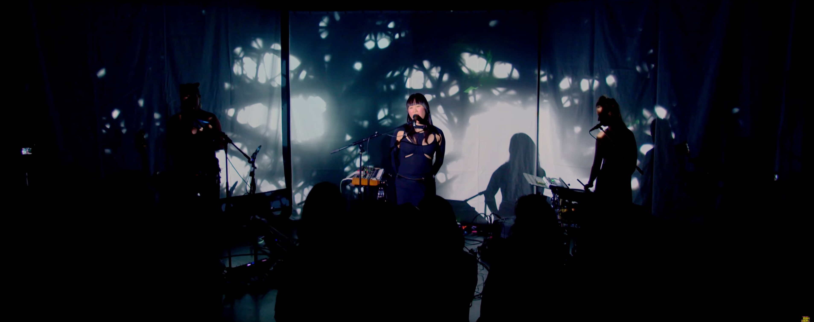
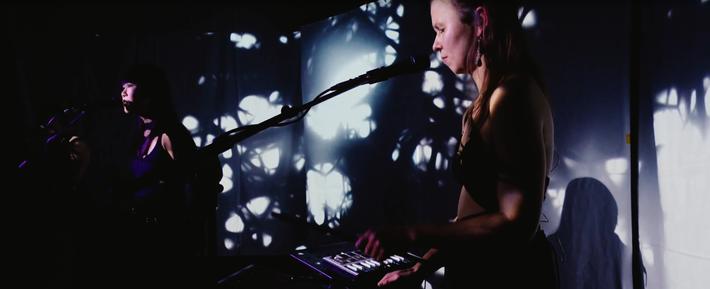

# Mayuko Human

## Goal

For this project I worked together with a befriended band of mine - Mayuko - partly based in Berlin and Mannheim. I was supposed to perform visuals at a record release concert in Mannheim. In the end, this was supposed to result in a live music video. For this I had to expand my live VJ set, which had grown over the years. Three new visuals were created, each of which can be played like a visual musical instrument. However, only one song was selected for publication on YouTube. So unfortunately you can only see one visual [here](https://www.youtube.com/watch?v=2tJEjpioFos). However, the second added live visual has strong similarities with this [visualizer](https://www.youtube.com/watch?v=JDZN632UEn0) I produced before. For the third one I put a gif representative gif in the lower section of the implementation part. The difference from the visualizer for Mayuko - Imaginary Bubbles to the live visuals is that I have rewritten the whole program to have better performance in a live context with my laptop rather then with my desktop pc that I used for screen recording movie files. I edited these files together in premiere to produce this visualizer. For live concerts I just take my laptop with me so it needed to be rewritten to fit into the performance spec's of my laptop and still be usable.

### Implementation

The first visual I programmed works with voronoi noise as its basis. The functionality tree would look like this:

- Base noise function = voronoi
  - animate noise over time
  - multi fractal sum of base noise (also known as rigid turbulence)
- placing multiple sdf circles on the canvas
  - circle rearrange themselves with the help of midi controllers
    - filtertime of replacing, size and distortion of sdf-circles is adjustable via midi controller
- substract fractal noise from sdf circles
- domain distort circles as well as the whole noise texture with another voronoi noise field
  - adjustable via via Midi
- rgb-displace texture with another perlin noise field

The second visual I programmed work with a volumetric texture .dds file of the text Mayuko which is then used in a raymarching context to display 3d text that can be moved and distorted according to the live music. The basic functionality tree is as follows:

- Load in the .dds volumetric texture file
- Convert the volumetric texture into an 3d signed distance field
- Make it transformable in 3d space by mapping 3d transform parameters like scale, rotation and position to midi controllers
- Domain distort the 3d sdf text with a divergence free noise field which's parameters can also be adjusted via mid controllers
- Raymarch the text with a MatCap raymarching algorithm
- Build a MatCap texture array
- Load multiple preselected MatCap's
- randomly pick a MatCap from the texture array when pressing a midi controller button

For the third visual extension to my visual program I wanted to go into a more noisey feeling like structure as seen in the gif above.The basic functionality tree is as follows:

- grid array as a starting point for a dynamic buffer of stream lines
  - add low random values to not have them start too uniformly
  - starting points and directional multiplication can be transformed into any direction
- set length of streamlines to make them fill the screen
- multiply directionally to face lines towards the camera
- distort lines with 3d vector noise fields
  - noise field is fractal multiplied and also domaindistorted
- make noise field as well as stream lines transformable to have uniform movement
- lower alpha values of lines to have a more organic look
  - add some motion blur to them
  - also added the possibility to fill the framebuffer over time to have cool striped looking lines
- multiply noise texture for more organic looks
- add multiple parameter controls for making it playable to live music

### Learnings

- optimizing for more performance
- making use of noise fields in combination with sdf's in a live music context
- Voronoi and different inflections
- different types of fractal sums
- Divergence free noise fields
- frame buffer in vvvv-beta