# StoneTechno Visuals

## Goal

For this project I was asked if I could create audio-reactive visuals as part of a festival in Essen (StoneTechno). These were to deal with the topic of thin sections in a narrower sense, as the StoneTechno festival places great emphasis on science communication. Thin sections are transparent plates of different sizes and thicknesses that are made from rocks, minerals, fossils or other materials hardened with special resin and used in the geosciences to determine their composition, optical properties or fine structures under a microscope. Exemplary images are shown here.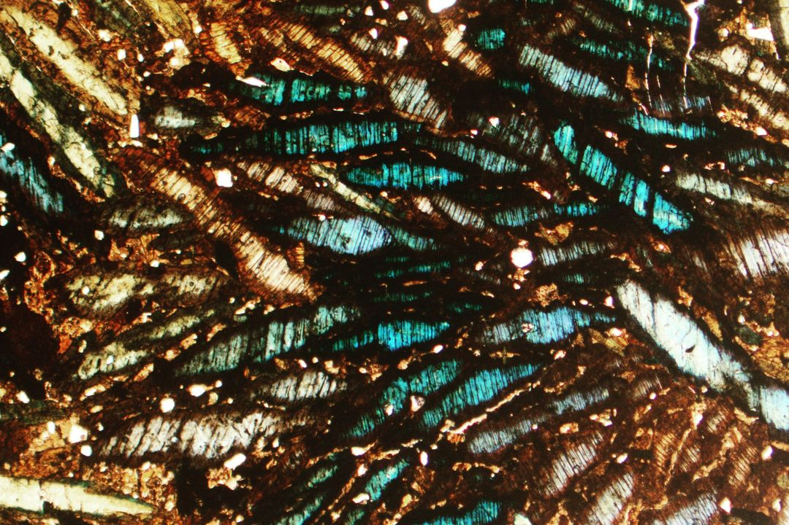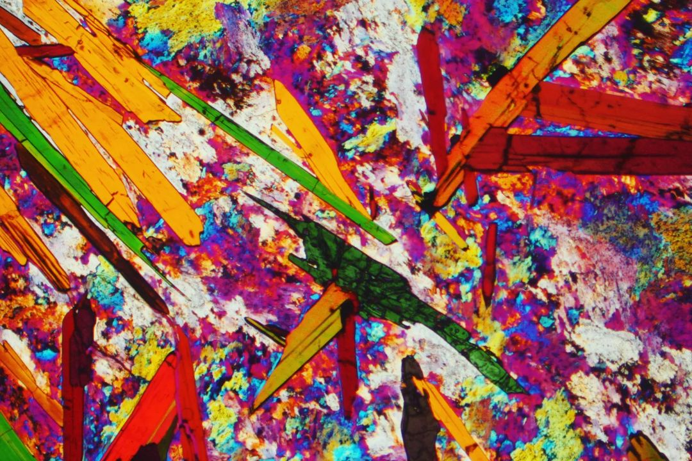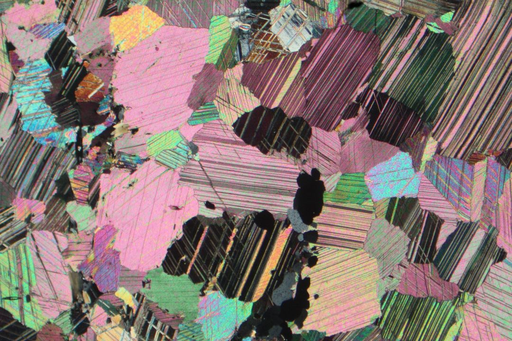
I immediately noticed that the images of thin sections have strong similarities with several different types of procedural noise. Therefore, I wanted to program most of the visuals using shaders using the vvvv-gamma inherent library VL.Fuse.
Furthermore, I wanted to transfer the thin sections from a flat 2D world into a 3D world and thus achieve a higher degree of abstraction. For this I wanted to use the previously used procedural noise algorithms as a basis for generative 3d particle systems and raymarching.

### Technical specifics

On the technical side I would be working an LED-panel wall that would be distributed over the whole are. The size of each panel would be 104 x 104 pixels. Three of them would be stacked on top of each other so every "display" on its own is then 312h x 104w and 20 of those small displays make up for the whole LED-wall with a total resolution of 2080x312. Because of the LED-Controller was only capable of putting out a resolution of 1920x1080 I had to split up the "wide screen" into two sections on top of each other that resulted in a output resolution of 1040x624. This is better visualized by these three pictures.

1. initial render sized image 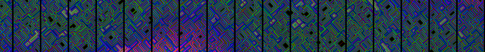
2. adjusted screen space 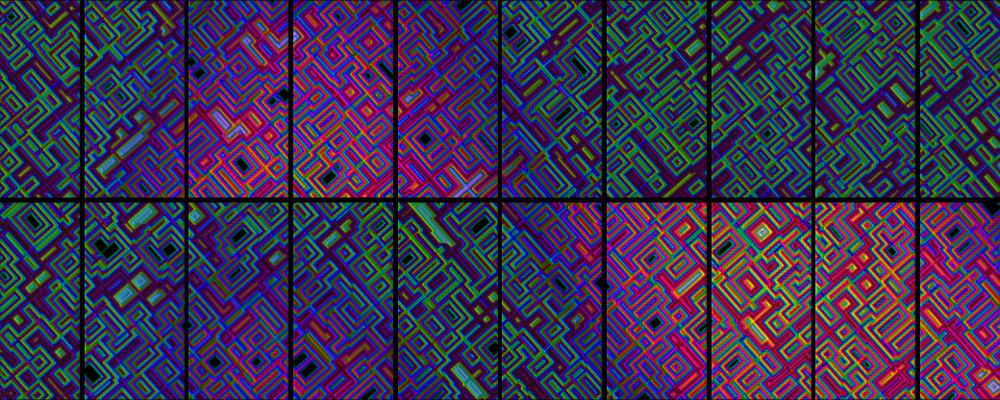
3. real life view 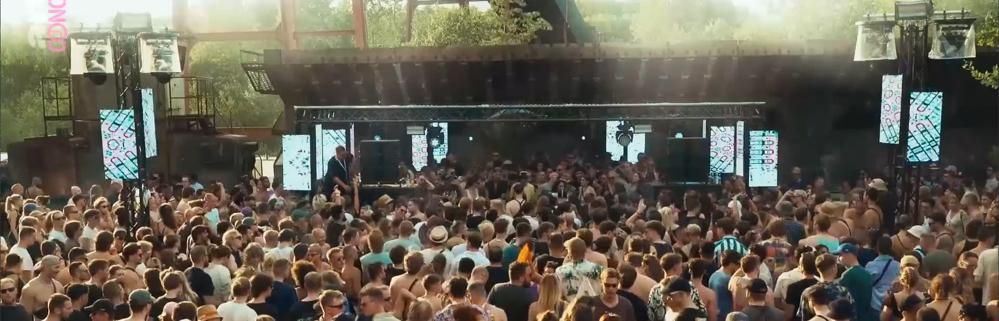

### Implementation

In the following I will give an overview of the general structure of the program but will not go into further detail as this would go beyond the scope.
The program consists of:

- A first type of thin section visualized by making use of worley noise 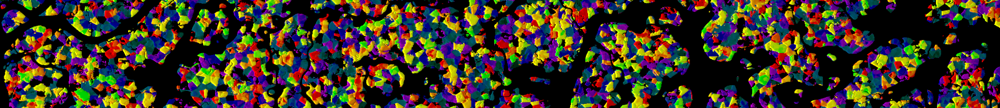
- A second thin section type that was realized with normal perlin noise and different multiplied inflection types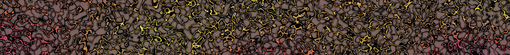
- A third thin section type that closely resembles how Bismut would look like as a thin section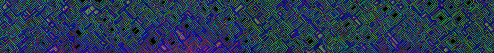
- Raymarched molecular structure of diamond
- Particles that originate from a procedural noise field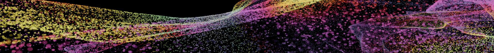
All visuals are being created by visually programming shaders inside of vvvv-gamma. The visuals all have different suitable parameters exposed for being manipulated with a total of four Midi-controllers. To not loose oversight of which parameters are mapped onto which Midi-button or knob, while playing everything in a live context, I build a graphical user interface. It also has a texture build in to see the actual output  that I generate. This was needed because the screens on the dancefloor where wide spread and I could not see most of the contet that I needed to display.
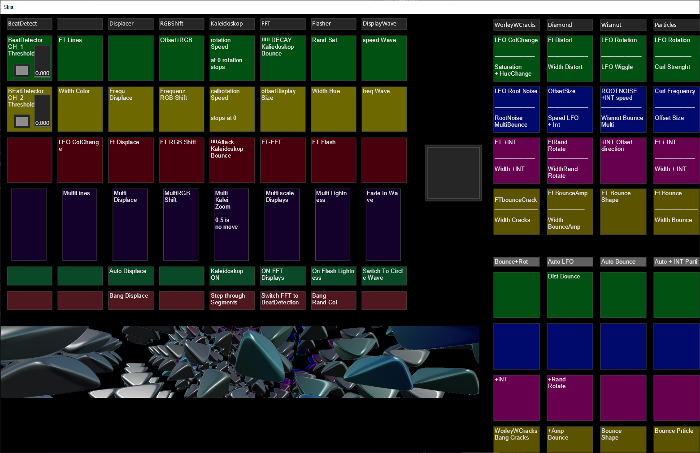

To further enhance the audio reactive functionality of the program I also implemented:

- projection of the rendered texture onto moving quads
- RGB-shifted texture effect
- Displacement texture effect
- Audio reactive moving quads per display that scale according to a FFT's output values
- Kaleidoskop effect
- Lightness reacting texture effect
- Lightness-wave over all displays that can change frequency, speed and direction
- a tempo-tap functionality to be enable steady bouncing of mapped parameters

A video of the DJ-set with my visuals can be seen under [this Link](https://www.youtube.com/watch?v=kVMqMlmZmLQ&t=2732s)
Because the displays on the dancefloor where so wide spread from another I uploaded a quick demo clip of how this would look as a complete wide screen rendered image as a [GIF](https://1drv.ms/i/s!AuYNJNLvJdI8kud9PRPv6xiU_zEUkg?e=M7y6K9) (you maybe need to wait a little bit until the gif is completely loaded because it is very big in size).

### Learnings

- transfer real-life images into abstract visuals
- getting more used to the FUSE-library
  - visual patching shaders
- building a graphical user interface
- spanning textures over quads to adjust for usable screen space
- blending textures with control textures
- projecting textures
