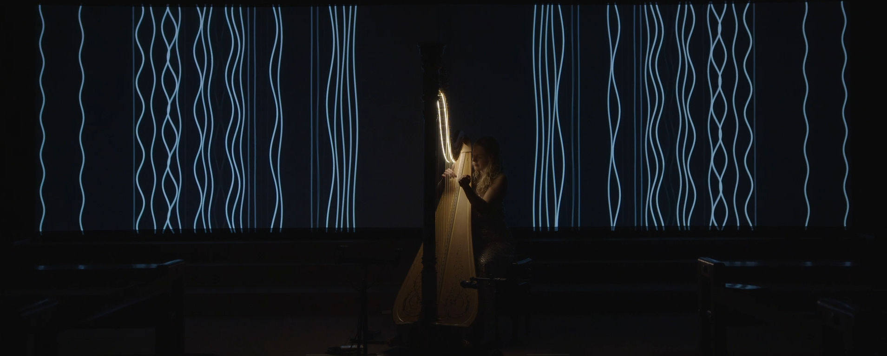
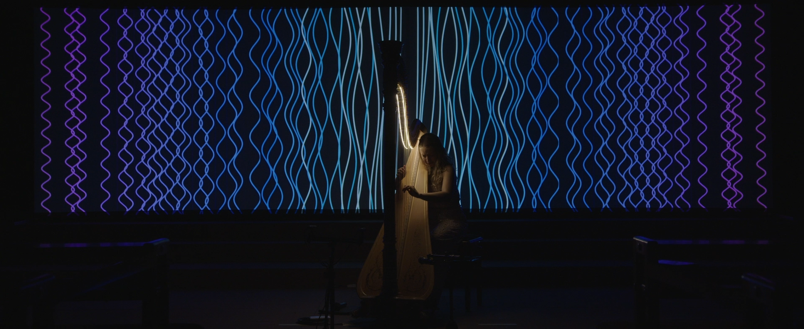
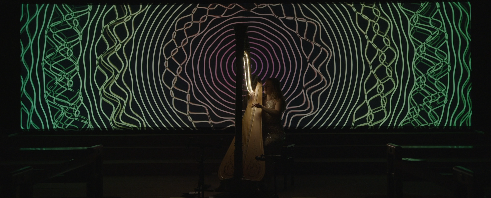
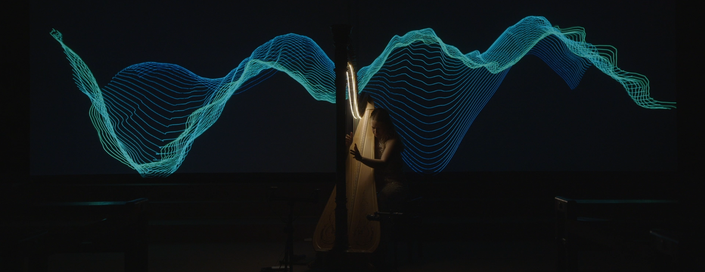
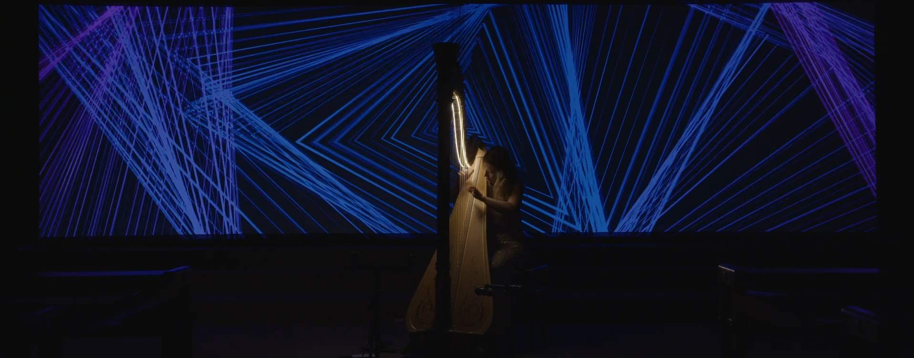
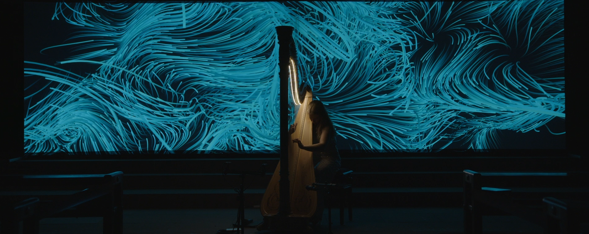

# Strings In Motion

## Goal

For the Strings I Motion project, I collaborated with a harpist friend of mine (Lea Maria Löffler) whom I met during my time at the Cité des Arts Internaional in Paris. In this project we set ourselves the goal of using the harp as a basic concept for visual design. The visualizations should react to what is played in a live context during the concert. We also wanted to bring the visualizations onto a screen behind the harpist using a double projection with an aspect ratio of 32:9.
I immediately had the idea of projecting the 47 strings of the harp as an abstraction of multiple pairs of lines. Then, by using the audio signal of the harp, the lines would change over time and then be transformed into other states.
A small trailer of the concert can be found [here](https://www.youtube.com/watch?v=bx0Fv8Ti_qo)

## Implementation

Because I am most confident in visual programming using either vvvv-beta or vvvv-gamma I first tried to compare which one would be the most suitable program for me to work with in this scenario. I had mixed feelings about the general performance bottleneck of vvvv-gamma because it is using C# as the overall programming language and vvvv-beta is making use of C which is way more performant and especially with the instance noodle addon, which makes use of Compute & Geometry shaders, is very fast on the GPU. In the end vvvv-beta outperformed vvvv-gamma and I chose to stay with this software.
The basic functional chain was therefore planned as follows:

- Audio signal is fed into my audio interface via piezo pickup 
- Audio signal is read within vvvv-beta and used to apply movement in the lines.
- Midi controllers are used to control lots of parameters within the written program and to further develop them into various visual appearances.

In general I had developed 5 different visual appearances that I could use for a concert of about 50min length. Every visual could be adjusted in realtime and was audio reactive. I will shortly go over the basic functionality of every part of the program.

### Vertical Strings

The first visual consists of 47 Lines that are moved like a normal sine would on an oscilloscope. Therefore I tried to separate each tone the harp would play with the help of an FFT.  Every string that's played would then result in one line that is deflected in the form a moving sine wave. When Lea would then play multiple tones or a chord a lot of lines would then deflect corresponding to what pitch is played. The problem that came with using a FFT for this was that I couldn't really get a good separation for each string of the harp to represent one line on the screen because even one string that's pulled produces a lot of overtones that also fall into the scope of the measured spectrum and by that deflect a lot of lines at the same time. But in the end I really got it done in a way that looked very natural.  The amplitude, color, lightness, thickness and movement speed could be adjusted via Midi.

### Circular Lines

For the second visual I had the same approach as with the vertical Strings before but I arranged all the strings in a circular manner. Also the lines where subtracting their colors from each other. The whole circle structure is also enabled to displace itself in the z-axis by a perlin noise function. I could also step through the noise field and by that have a more immersive visual experience.

### Horizontal Lines

The third visual is changed in a way that the lines are arranged horizontally and they take the total audio signal into account which then later shifts up a line over time. The whole structure also displaces in the z-direction and is also able to rotate on the y-axis over the course of the concert whenever I feel like it fits the situation by turning a knob on my Midicontroller

### Triangle Lines

With the fourth visual I wanted to  transform the lines into a more abstract representation of the strings of the harp so the direct connection between audio and visual is loosened a bit. Each corner of a triangle is mapped to one slice of the audio buffer that is read from the piezo microphone. Then on every next frame the values shift to the next bigger triangle and the first triangle reads in the next values from the audio buffer and so forth. By that beautiful pattern arise. On top of that the array of triangles can be twisted in itself which even increases visual complexity.

### Seagrass Lines

For the last step of abstraction I produced a grid of Lines facing in the y-direction. The lines are deflected with the help of an procedural vector noise field that is iterated over time. The length of each "sea grass line" is changed according to the amplitude of the spectrum of the audio signal. I also could make the spectrum more narrow and by that only show less lines reacting to the sound of the harp or have the spectrum analyzed wider and by that have more lines reacting. The whole grid of lines could rotate, change speed of integration through it's noise field, change hue, width, saturation and lightness all according to what is being played from Lea at the moment

## Learnings

- Make visuals work in a more subtle way to fit a classical concert purpose
- FFT's and how hard it is to get good spectrum separation
- Audio buffers
- Lines
- To fill a concert with only one basic visual concept → a line
- Churches are one of the best concert locations