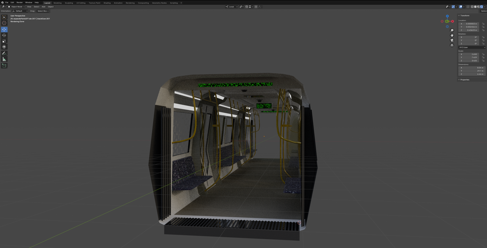

# Subconscious Ride

## Goal

Sitting in the berlin subway at night when not many people are around has always fascinated me because I like how the whole subway bends itself over the track it is on when it is driving. Especially how it behaves in the curves is very beautiful to look at if one has a clear view through the whole subway. Because it is not very common for everyone to have an empty subway I wanted to recreate this experience as an installation in 3d with a little twist to it that distorts the train like when having an LSD trip. This is why the title is called subconscious ride. I also wanted to get more into the software vvvv-gamma and see whats possible with that, so I build a first functioning prototype with this. A demonstrational Video can be found [here](https://www.youtube.com/watch?v=cLO13B6ZYWk). Quick note: in this video some of the installations capabilities are still missing. This is only an interim result. Complete capabilities, with rotation accumulation in a universe skybox can be seen in the gif's in the implementation section.

## Implementation

I had many challenges and problems throughout this project so I only just briefly touch upon what I've done to achieve the final results. Some (there where way to many) of the more important problems are mentioned in the "problems and solutions" section below.
The basic steps for making this project work where the following:

- Model a subway in Blender
- cut down vertices to have lower vertex count as that affects real time performance
- export as .dae for making multiple objects of the subway accessible in vvvv-gamma
- Importing the model into vvvv-gamma 
- color each of the objects
	- rods, seats, metal plates, cameras, video screens, windows, walls. ceiling
		- every material was textured by using VL.Fuse library. Either with normal pbr-materials(rods), imported textures (windows) or even by adding procedural real time materials (seats, screens, ground)
- building an array of subways that are connected to each other in 3d space
- placing the array of subways onto a path that changes over time and is endless (the teapots are substitutes for the subway as i tried that first with a simpler patch and then ported the functionality over into the main program) 
- placing lights besides the track that move next to the subway an give the illusion of moving forward
- set up a skybox with a universe sky to have some points of reference for strengthening the perception of movement through space
- accumulate changes in position and rotation to have a better feeling of really moving though space
- tesselate the subway for better displacement
- enable function based vertex displacement for all segments of the subway
- add camera with shaking but still some kind of fixed position to the last wagon of the subway

## Problems and solutions

- at first I wanted to export the subway as a .fbx high poly model  with baked textures. That didn't work out as I imagined it because of the following problems:
  - too many vertices where unoptimised in relation to the resolution of the baked texture, meaning:
    - by baking the textures some important areas on the model (e.g. windows, seats and ground) have had too little resolution which wasn't acceptable from an asthetic view. The handles, trainbody and metalobjects where looking good because they only consist of one color but everything that had a finer level of texturing on it where looking like crap
  - I was trying to export every part of the train as a separate object:
    - It made it too difficult to put more subways behind each other
- Couldn't build glass together with all the materials in one loop
- Glass in combination with the texture of the Brandenburger Tor had problems to display the shadows the right way
- Subway and movement of lights on track didn't behave as I wanted → Lights on the end of the first subway segment where making an unnatural light because there is no segment after the subway segment where the camera is placed in 
- Subway segments where moving back and forth on the sampled track because of the resampled method
- PointNormalTesselation is way to expensive on the GPU
- Lights couldn't be instanced → I have no real solution for that^^
  - Point lights take up too much computing power
  - Using spotlights is way cheaper on the GPU
- When trying to construct a path for the train to move on the rotational behaviour of the subway segments was off
  - problem was the output of the angleNode that is used after resampling points of a spline path: Its Output ranges from -0.5 to 0.5 for a full 360degree rotation. But in vvvv-gamma the values normally go from 0.0 to 1.0
- I did a small loop to detect the sign change and then add 1.0 for each new cycle → took me a whole day to find out^^
- I tried to go around the problem of having a circular array and by that going only in one direction of a curve
  - I did this by shifting random values through an array which is resampled linearly and by that I got the movement of a snake like thing 
    - I optimised it further by not shifting values through the indices of the array but by going through values of simplex noise inside of a for each loop is far more easy
- Lights moving besides the path of the train needed to be filtered to have smoother motion but by that they also jumped visible from back to front which is not good
- 
  - I solved this by turning down the filter time of the lights at the starting and end point's index of the array they where moving through

## Learnings

- Modelling in Blender using modifiers
- Importing 3d models for real time applications
- Troubleshooting buggy behaviour in .fbx and .dae files
- Applying pbr materials for parts of model
- Procedural materials
- Lighting in vvvv-gamma
  - shadow maps
  - limitations
- Construct arrays on spline to move along and change over time
- Create camera movement that feels like riding on a train
- Accumulation of rotation and position changes for better immersion
- About different kinds of tesselation
- Function based vertex displacement
